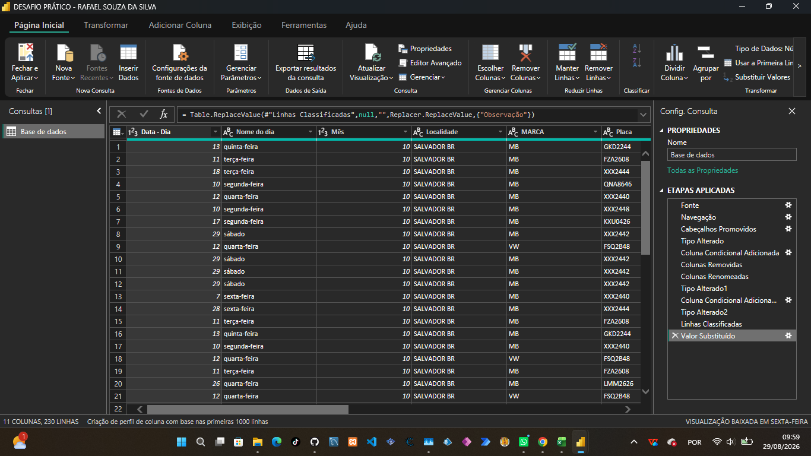
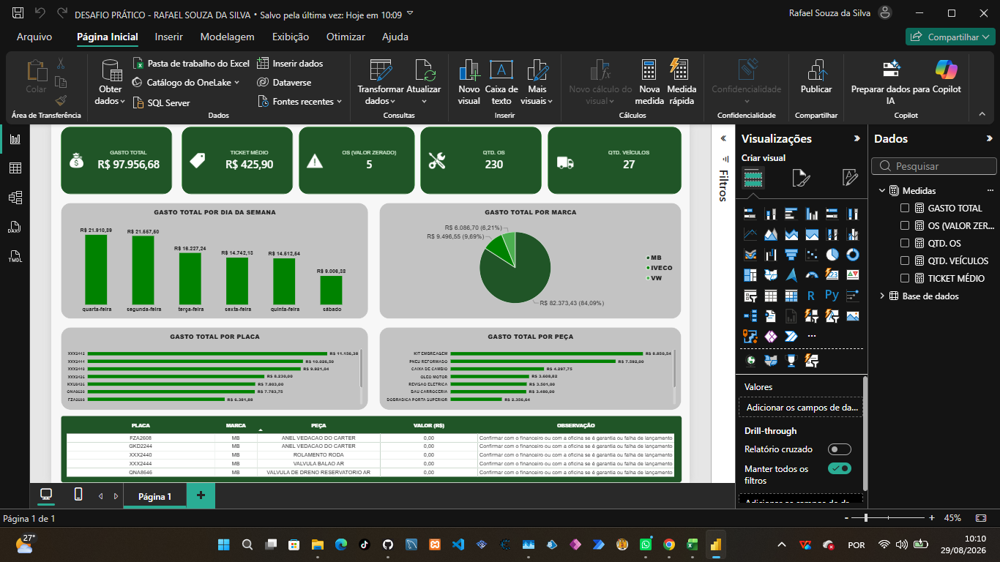
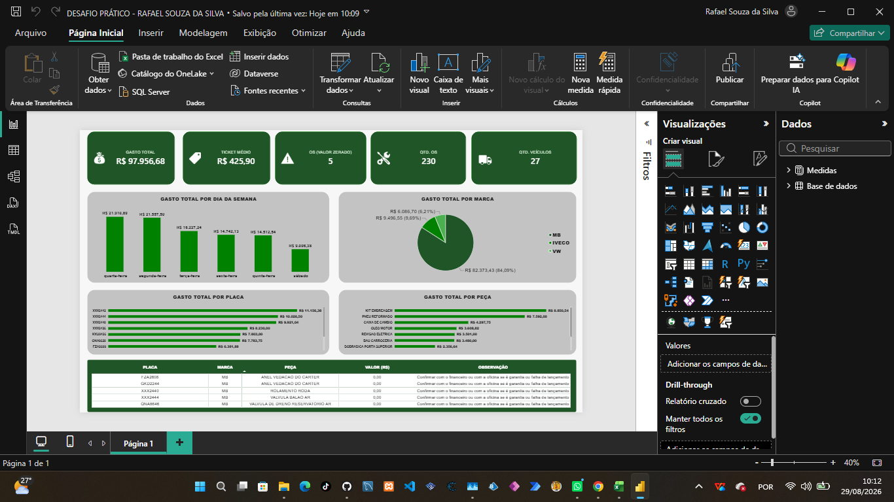

# Desafio Prático — Análise de Manutenção de Frota (Heineken)

Este repositório documenta a resolução do desafio de 2ª etapa do processo seletivo de Estágio (Heineken/Randstad): a partir de uma base de dados fictícia de manutenção de uma frota de veículos em Salvador/BA, foi feito o tratamento dos dados, a definição de indicadores e a construção de um dashboard gerencial no Power BI.

A base original tinha **230 registros, 10 colunas, 27 veículos, um único mês (outubro) e uma única localidade (Salvador/BA)**.

---

## 1. Tratamento de Dados

Todo o tratamento foi feito **dentro do Power Query** (não em uma planilha à parte), para que cada decisão de limpeza fique registrada e visível como uma etapa separada no histórico de consultas do Power BI — isso deixa claro *como* os dados foram analisados, não só o resultado final.

### 1.1 Conferência dos tipos de dados
Antes de qualquer tratamento, foi confirmado que cada coluna estava com o tipo correto:
- `Valor (R$)` → número decimal
- `Idade`, `Data - Dia`, `Mês` → número inteiro
- Demais colunas → texto

Isso é importante porque, se uma coluna numérica for lida como texto por engano, operações como soma ou média simplesmente falham ou retornam resultado errado, sem aviso claro.

### 1.2 Padronização da coluna "TIPO CARROCERIA"
Ao analisar os valores únicos dessa coluna, apareceram 4 categorias: `3/4 BAÚ`, `3/4 TRUCK BAÚ`, `TRUCK BAÚ` e `TOCO BAÚ`.

- A placa **FUE4266** (marca MB) estava cadastrada como `TRUCK BAÚ`, enquanto as outras 24 placas do mesmo porte de veículo estavam como `3/4 TRUCK BAÚ` — uma clara falta de digitação do prefixo "3/4".
- **Correção aplicada:** uma *Coluna Condicional* no Power Query, com a lógica:
  > SE `TIPO CARROCERIA` for exatamente igual a `TRUCK BAÚ` ENTÃO `3/4 TRUCK BAÚ` SENÃO manter o valor original da própria coluna.

  Essa lógica corrige apenas as 2 linhas afetadas (as duas ordens de serviço da placa FUE4266), sem alterar nenhuma das outras 228 linhas que já estavam certas.

- **Por que não usar "Substituir Valores"?** Essa função do Power Query troca qualquer ocorrência do texto dentro da célula, não só quando a célula é exatamente igual ao termo buscado. Como `3/4 TRUCK BAÚ` já contém a sequência de caracteres `TRUCK BAÚ` dentro dela, usar "Substituir Valores" bagunçaria as 158 linhas que já estavam corretas, transformando-as em `3/4 3/4 TRUCK BAÚ`. A Coluna Condicional compara o valor inteiro da célula, evitando esse problema.

### 1.3 Verificação da categoria "TOCO BAÚ"
A placa **GAC4A48** (marca VW) é a única com a carroceria `TOCO BAÚ` na base inteira. À primeira vista, isso parece um possível erro de digitação (parecido com os outros tipos), mas uma pesquisa sobre classificação de porte de caminhões no Brasil confirmou que **"Toco" é uma categoria de porte real e distinta** — a hierarquia usual é VUC → 3/4 → Toco → Truck → Bitruck, cada uma indicada para uma faixa de carga diferente.

**Conclusão:** essa linha **não foi alterada** — é um dado correto, não uma inconsistência. Isso ilustra um ponto importante do desafio: nem todo valor "diferente do padrão" é um erro; é preciso confirmar antes de "corrigir" algo que já está certo.

### 1.4 Sinalização de valores zerados
Foram encontradas **5 ordens de serviço com `Valor (R$) = 0,00`**, referentes a peças como *válvula de dreno do reservatório de ar*, *rolamento de roda* e *anel de vedação do cárter* (essa última em duas placas diferentes).

Um valor zerado pode significar duas coisas opostas:
- **Garantia** — a peça foi trocada, mas o custo foi coberto pelo fornecedor/fabricante. Nesse caso, R$ 0,00 é o valor correto.
- **Falha de lançamento** — quem registrou a ordem de serviço esqueceu de preencher o valor. Nesse caso, R$ 0,00 está **subestimando** o gasto real da frota.

Como não é possível saber qual das duas situações se aplica apenas olhando a planilha, foi criada uma segunda *Coluna Condicional* chamada `Observação`:
> SE `Valor (R$)` for igual a `0` ENTÃO `"Confirmar com o financeiro ou com a oficina se é garantia ou falha de lançamento"` SENÃO deixar em branco.

Essa coluna não tenta adivinhar a resposta — ela documenta que existe uma pendência e diz exatamente com quem confirmar, transformando um problema silencioso (que distorceria os indicadores) em algo visível e endereçável.

### 1.5 Consulta tratada, no Power Query



### 1.6 Finalização
Depois desses dois tratamentos, a consulta foi fechada com **"Fechar e Aplicar"**, carregando a tabela tratada (230 linhas, 11 colunas — as 10 originais mais a coluna `Observação`, com `TIPO CARROCERIA` já padronizada) para o modelo de dados do relatório.

---

## 2. Indicadores e Medidas (DAX)

### 2.1 Por que esses indicadores
A escolha dos indicadores seguiu a lógica do que um gestor de frota realmente precisa saber, em ordem de prioridade:
1. **Quanto foi gasto** (visão geral)
2. **Qual o custo médio por atendimento** (para julgar se um valor específico é alto ou baixo)
3. **Quantos atendimentos e quantos veículos** (para dar escala ao número acima)
4. **Quantos registros precisam de decisão humana** (os valores zerados) — esse é o indicador que transforma o dashboard de "relatório" para "ferramenta de ação"

### 2.2 As 5 medidas criadas

Todas foram criadas como **medidas DAX** (não como colunas calculadas), porque uma medida recalcula dinamicamente conforme o usuário aplica filtros no relatório (por marca, por dia, etc.), enquanto uma coluna calculada fixaria um valor por linha que não reagiria a filtro nenhum.

```dax
Gasto Total = SUM('Base de dados'[Valor (R$)])
```
Soma o valor de todas as ordens de serviço. É o indicador mais geral: quanto a frota custou de manutenção no mês.

```dax
Ticket Médio = AVERAGE('Base de dados'[Valor (R$)])
```
Calcula a média do valor por ordem de serviço. Serve como referência: qualquer atendimento muito acima desse valor médio merece atenção.

```dax
Qtd OS = COUNTROWS('Base de dados')
```
Conta o número total de linhas da tabela, ou seja, quantas ordens de serviço (atendimentos) foram registradas no mês.

```dax
Qtd Veículos = DISTINCTCOUNT('Base de dados'[Placa])
```
Conta quantas placas **diferentes** aparecem na base — ou seja, quantos veículos únicos tiveram algum tipo de manutenção, mesmo que um veículo específico tenha aparecido em várias ordens de serviço.

```dax
OS com Valor Zerado = CALCULATE(COUNTROWS('Base de dados'), 'Base de dados'[Valor (R$)] = 0)
```
Conta quantas ordens de serviço têm valor R$ 0,00 — é a medida que quantifica o ponto de atenção identificado na etapa de tratamento (item 1.4).

### 2.3 Resultado dos indicadores
| Indicador | Valor |
|---|---|
| Gasto Total | R$ 97.956,68 |
| Ticket Médio | R$ 425,90 |
| Qtd. OS | 230 |
| Qtd. Veículos | 27 |
| OS com Valor Zerado | 5 |

---

## 3. Layout Final do Dashboard

Tudo foi organizado em **uma única página**, em fileiras, seguindo a lógica de leitura "do resumo para o detalhe": primeiro os números gerais, depois o porquê desses números, e por último o que precisa de decisão.





### 3.1 Fileira 1 — Cartões de KPI
Cinco cartões, cada um mostrando uma das medidas descritas na seção 2.2:

| Cartão | Medida usada | Ícone |
|---|---|---|
| Gasto Total | `Gasto Total` | saco de dinheiro |
| Ticket Médio | `Ticket Médio` | etiqueta de preço |
| OS (Valor Zerado) | `OS com Valor Zerado` | alerta/triângulo |
| Qtd. OS | `Qtd OS` | chave de ferramenta |
| Qtd. Veículos | `Qtd Veículos` | caminhão |

**Estilo aplicado:** fundo verde sólido (`#008200`, tom principal da identidade Heineken), texto do valor em branco e negrito (fonte Segoe UI/Arial, tamanho ~24px), título do cartão em fonte menor e mais discreta, cantos arredondados (raio ~12–16px), e um ícone pequeno posicionado à esquerda do valor.

### 3.2 Fileira 2 — Onde o dinheiro está sendo gasto
- **Gráfico de barras "Gasto por Dia da Semana"** — eixo X com `Nome do dia`, eixo Y com a medida `Gasto Total`. Mostra que quarta e segunda-feira concentram os maiores gastos do mês.
- **Gráfico de pizza "Gasto por Marca"** — categoria `MARCA`, valores `Gasto Total`. Mostra que a marca **MB concentra 84% de todo o gasto** (R$ 82.373,43), contra 9,7% da IVECO e 6,2% da VW — o dado mais relevante da análise, já que expõe onde está a maior parte do custo de manutenção.

### 3.3 Fileira 3 — Onde investigar mais a fundo
- **"Top 10 Veículos por Gasto"** — barras horizontais, campo `Placa` no eixo, `Gasto Total` como valor, com filtro **Top N = 10** aplicado (por valor de `Gasto Total`). A placa **XXX2442** aparece isolada no topo, com R$ 11.156,38 — quase o triplo do ticket médio da frota.
- **"Top 10 Peças por Gasto"** — mesma lógica de Top N = 10, campo `Peça` no eixo. `KIT EMBREAGEM` é a peça de maior gasto acumulado (R$ 8.850,54).

### 3.4 Fileira 4 — Tabela de pontos de atenção
Tabela com as colunas `Placa`, `MARCA`, `Peça`, `Valor (R$)` e `Observação`, **filtrada para mostrar apenas as linhas onde a coluna `Observação` não está em branco** (as 5 ordens de serviço com valor zerado descritas no item 1.4). Cabeçalho estilizado em verde (`#008200`) com texto branco, corpo da tabela centralizado, para destacar visualmente que essa é a seção que exige uma decisão de alguém do financeiro/oficina — e não apenas um dado a mais para consultar.

### 3.5 Paleta de cores utilizada
| Cor | Código | Uso |
|---|---|---|
| Verde principal | `#008200` | Cartões, cabeçalho de tabela, fatia principal do gráfico de pizza (marca MB) |
| Verde escuro | `#205527` | Tons secundários dos gráficos (marca IVECO/VW), fundo de destaque |
| Cinza | `#C3C3C3` | Bordas, fundos neutros dos gráficos |
| Vermelho | `#FF2B00` | Reservado exclusivamente para elementos de alerta genuíno (não usado nas marcas/categorias comuns, para não confundir com "problema") |

---

## Ferramentas utilizadas
- **Power Query** — tratamento e padronização dos dados
- **Power BI Desktop (DAX)** — criação das medidas
- **Power BI Desktop (relatório)** — construção do dashboard e aplicação de tema visual customizado
